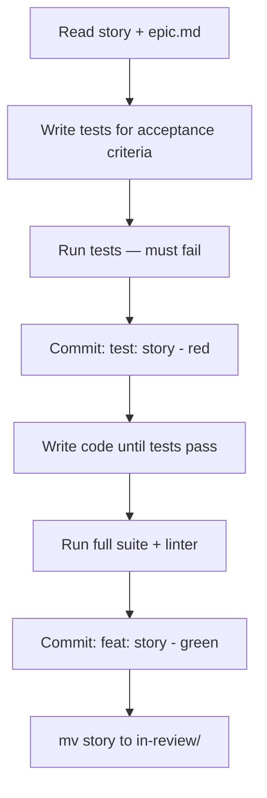

# Active (Story)

## Rules
- Tests FIRST — no code without failing tests
- Every acceptance criterion = at least one test
- If blocked: write question in `## Blocked`, set `agent_status: blocked`, STOP
