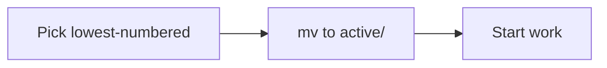

# Backlog (Story)

Stories here are defined but not started.

```mermaid
flowchart LR
    Pick[Pick lowest-numbered] --> Move[mv to active/] --> Work[Start work]
```

Do NOT work here. Move first, then work.
