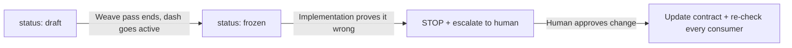

# Contracts

Contracts are the frozen interfaces between epics in a dash. They are why the
epics can run in parallel: everyone builds against the contract, not against
each other's in-flight code.

## Lifecycle

## Rules
- Every contract has exactly **one owning story** (`owner:`) — the story that
  implements it. Owners float to the front of their epic's graph.
- Consumers list the contract in their story frontmatter: `contracts: [name]`
- `## Open Questions` must be empty before freeze
- A frozen contract is LAW. If implementation reveals it's wrong:
  1. STOP every story downstream of it
  2. Write the problem in the implementing story's `## Blocked`
  3. Escalate to the human. Do NOT silently edit a frozen contract.
  4. If the human approves a change: update the contract, then re-check every
     consumer: `grep -rl "contracts:.*<name>" ..`
- Do NOT create contracts outside planning — a mid-dash contract means the
  weave pass missed a touchpoint. Escalate that too.
