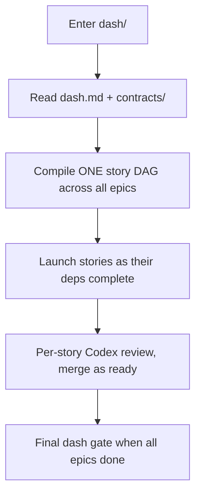

# Active (Dash)

Dashes here are greenlit. Enter the dash folder and follow its `CLAUDE.md`.

## Rules
- Contracts are FROZEN — a wrong contract is an escalation, not an edit
- Follow the DAG — cross-epic edges in dash.md, in-epic edges in each epic.md
- Blocked stories > wrong implementations
- No waves — a story starts the moment its dependencies are completed
