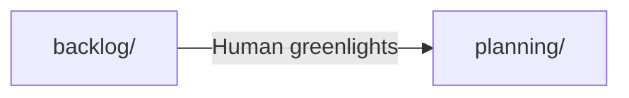

# Backlog (Dash)

Dashes here are ideas waiting to be planned. A dash is a set of epics shipped
together — shorter than a sprint.

## Rules
- Do NOT plan without being asked
- Do NOT move to active — must go through planning first
- Read dash.md files to understand roadmap
