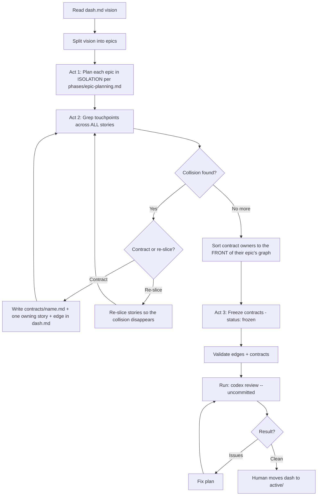

# Planning (Dash)

You are planning, NOT implementing. A dash plan is three acts: plan each epic
in **isolation**, then **weave** them into one graph, then **freeze** the
contracts. Do not weave while planning an epic — isolation is what keeps
epics honest about their own scope.



## Act 1 — Isolation

Split the dash vision into epics, then plan each one with `phases/epic-planning.md`
as if it were standalone. One epic at a time (human Q&A is serial anyway).
Do NOT look at sibling epics while planning one.

**Create each epic inside the dash:**
```bash
cp -r templates/epic dashes/planning/my-dash/my-epic
# Epics sit one level deeper inside a dash — add one ../ to every import:
find dashes/planning/my-dash/my-epic -name CLAUDE.md -exec sed -i '' 's|@../|@../../|' {} +
```

**Skip the per-epic Codex story gate during Act 1.** Stories change during the
weave — the single dash-level Codex gate at the end reviews everything once.

## Act 2 — The Weave

Find every place two epics touch. Evidence, not vibes:

```bash
# Overlapping systems across the dash's stories
grep -rh "systems:" dashes/planning/my-dash/ | sort | uniq -c
# Which stories touch a specific system
grep -rl "systems:.*auth" dashes/planning/my-dash/
```
Also compare the files each story plans to touch (Technical Notes / Context Files).

For each collision, pick one:
1. **Contract** — `cp templates/contract.md dashes/planning/my-dash/contracts/<name>.md`.
   Define the exact interface. Assign exactly ONE owning story. List consumers,
   and add the contract to each consumer's `contracts:` frontmatter. Add an edge
   to dash.md's Cross-Epic Edges table.
2. **Re-slice** — move/split stories so the collision disappears. No edge needed.

**Every edge must be defended** with a contract AND a named touchpoint a grep
can confirm (shared file, schema, or system). "B might touch A's stuff" is not
an edge — speculative edges get deleted. Parallelism is free; edges are expensive.

Then sort each epic's internal graph so contract-owning stories come FIRST.
Contracts are the critical path — they must land and be reviewed before
consumers start.

## Act 3 — Freeze + Validate

Set every contract to `status: frozen`. After this, changing a contract is a
human escalation (see `phases/contracts.md`).

Validation checklist — all must pass before the Codex gate:
- Every edge endpoint in dash.md resolves to a real story file:
  `find dashes/planning/my-dash/<epic> -name "<NN>-*"`
- Every contract: exactly one `owner:`, at least one consumer, empty
  `## Open Questions`, `status: frozen`
- Every consumer story lists its contracts in `contracts:` frontmatter
- Every contract owner is at the front of its epic's dependency graph

## The Codex Gate

**MANDATORY. Run after validation, before reporting ready for active.**

```bash
codex review --uncommitted
```

The model is already configured in `~/.codex/config.toml`. Do NOT pass `-m`,
`--model`, or `-c model=` flags. Fix issues and re-run until clean, then report:
"Dash passed Codex review, ready to move to active."

## Rules
- **YOU drive discovery** — in Act 1 follow epic-planning's question loop per epic
- Isolation in Act 1 is strict: no cross-epic peeking, no premature contracts
- Edges live ONLY in dash.md — never scatter "blocked by" notes into story files
- An epic must still be runnable standalone if pulled out of the dash
- Do NOT move to active — human does that
- **Do NOT skip the Codex gate — it is the final gate before active**
