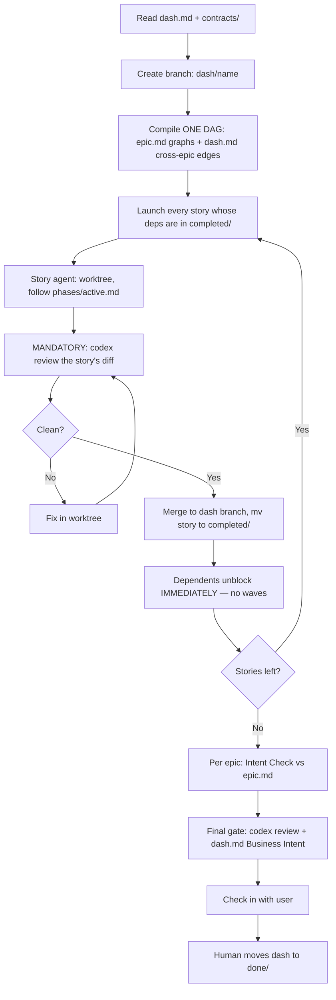

# Dash Workspace

Read `dash.md` first, then every file in `contracts/`. A dash compiles to
**ONE story-level workflow spanning every epic** — not one workflow per epic.
You are the **orchestrator**, not the implementer.

The old shape (implement everything, review at the end) makes review the
longest pole — a 30-story batch review takes hours and every fix ripples
through code built on top of it. Here review is continuous:
**merged means reviewed.**



## Compile the workflow this way
- **One DAG.** Nodes = every story in every epic. Edges = each epic's internal
  graph (from `epic.md`) plus the Cross-Epic Edges table (from `dash.md`).
- **Pure pipeline, no waves.** A story launches the moment ALL its
  dependencies — in-epic and cross-epic — are in `completed/`. The ONLY
  barrier is the final dash gate. Never hold a ready story waiting for its
  siblings.
- **Keep agents thin.** Each story agent's prompt points at `phases/active.md`,
  the story file, and any contracts the story implements or consumes. Do NOT
  re-encode TDD in the script.
- **Every story agent gets `isolation: 'worktree'`** — parallel epics WILL
  touch adjacent files.
- **Review-on-merge.** When a story's tests are green, run the Codex review on
  that story's diff in its worktree. Loop until clean. Only then merge to the
  dash branch and `mv` the story to `completed/`. A cross-epic edge waiting on
  that story is now safe to release: merged means reviewed.
- **Contract owners go first.** They are the critical path — everything
  downstream builds against post-review contract code.

## The Codex Review (per story)

Run this command exactly, from the story's worktree, before merging. Do NOT
modify it, do NOT add flags.

```bash
codex review --uncommitted
```

The model is already configured in `~/.codex/config.toml`. Do NOT pass `-m`,
`--model`, or `-c model=` flags.

## Contracts are law
Contracts were frozen in planning. If a story's implementation reveals a
contract is wrong: STOP that story and everything downstream of the contract,
write the problem in the story's `## Blocked`, and escalate. Never silently
edit a frozen contract. See `phases/contracts.md`.

## The Final Dash Gate
When an epic's last story reaches `completed/`, run a light Intent Check
against that `epic.md`'s Business Intent (gaps → new stories, back into the
DAG). When ALL epics are done:
1. **MANDATORY:** run the Codex review once more over the dash branch —
   per-story reviews saw each story alone; this pass sees the epics together.
   Loop until clean.
2. Re-read `dash.md` **Business Intent** — the cross-epic outcomes. Verify
   each is true in the code. Gaps → new stories → back into the DAG.
3. Check in with the user: summarize what was built, map it to the dash
   Vision, ask "Does this match what you envisioned?"

## Rules
- You are the **orchestrator**, not the implementer.
- **MANDATORY: no story merges to the dash branch without a clean Codex
  review. No exceptions, no batching reviews for later.**
- Cross-epic edges release on `completed/`, nothing earlier — `in-review/` is
  not merged.
- The workflow STOPS at the final intent check — the **human** moves the dash
  to `done/`.
- Dash with no cross-epic edges? Same DAG — it's just wider. Do not serialize
  epics that share no contract.
