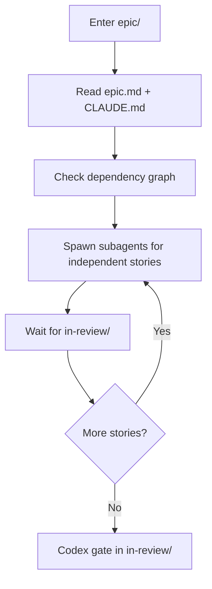

# Active (Epic)

Epics here are greenlit. Enter the epic folder and follow its `CLAUDE.md`.

## Rules
- Follow dependency graph — don't skip ahead
- Blocked stories > wrong implementations
- Use parallel mode (subagents) for speed
