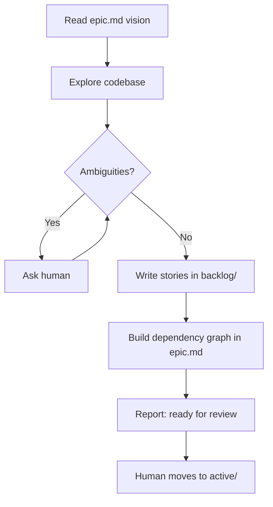

# Planning (Epic)

You are planning, NOT implementing. Goal: stories so specific an agent can work without questions.

## Rules
- Ask questions FIRST — planning is where ambiguity gets resolved
- Each story = one deployable unit with testable acceptance criteria
- Number stories: `01-`, `02-`, etc.
- Do NOT move to active — human does that
