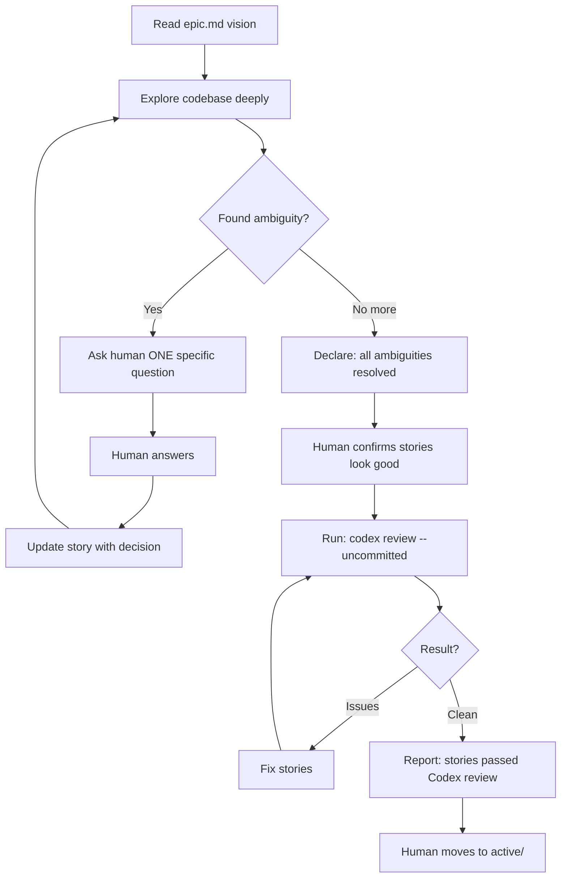

# Planning (Epic)

You are planning, NOT implementing. Goal: stories so specific an agent can work without questions.


```mermaid
flowchart TD
    Start[Read epic.md vision] --> Explore[Explore codebase deeply]
    Explore --> Find{Found ambiguity?}
    Find -->|Yes| Ask[Ask human ONE specific question]
    Ask --> Answer[Human answers]
    Answer --> Update[Update story with decision]
    Update --> Explore
    Find -->|No more| Done[Declare: all ambiguities resolved]
    Done --> Confirm[Human confirms stories look good]
    Confirm --> Codex[Run: codex review --uncommitted]
    Codex --> Result{Result?}
    Result -->|Issues| Fix[Fix stories] --> Codex
    Result -->|Clean| Ready[Report: stories passed Codex review]
    Ready --> Human[Human moves to active/]
```

## Your Job
1. **Populate Business Intent** - before anything else, work with the user to turn the Vision into concrete, checkable outcomes in the `## Business Intent` section. These are the "what MUST be true when this ships" statements that get verified at the end.
2. **Explore the codebase** - understand what exists, how it works
3. **Find gaps** - what behavior isn't defined? What edge cases exist?
4. **Ask specific questions** - "I found X in the code. How should Y behave when Z?"
5. **Update stories** - capture each decision immediately
6. **Codex story review** - after the human confirms ambiguities are resolved, run `codex review --uncommitted` to validate story quality. Fix any issues and re-run until clean.

## The Codex Story Gate

**MANDATORY. Run this after the human confirms stories look good, before reporting ready for active.**

```bash
codex review --uncommitted
```

The model is already configured in `~/.codex/config.toml`. Do NOT pass `-m`, `--model`, or `-c model=` flags.

- If Codex finds issues with story clarity, acceptance criteria, or gaps — update the stories with the fixes and re-run
- Loop until Codex is clean
- Then report to the human: "Stories passed Codex review, ready to move to active"

**Why:** Catching underspecified stories now is far cheaper than discovering ambiguity mid-implementation. Codex sees things the planning agent might miss.

## Rules
- **YOU drive discovery** - never ask "any other gaps?" - that's your job to find
- Ask ONE question at a time, wait for answer, update story, repeat
- When you have no more questions, say "All ambiguities resolved, ready for review"
- Each story = one deployable unit with testable acceptance criteria
- Number stories: `01-`, `02-`, etc.
- Do NOT move to active — human does that
- **Do NOT skip the Codex story review — it is the final gate before active**
