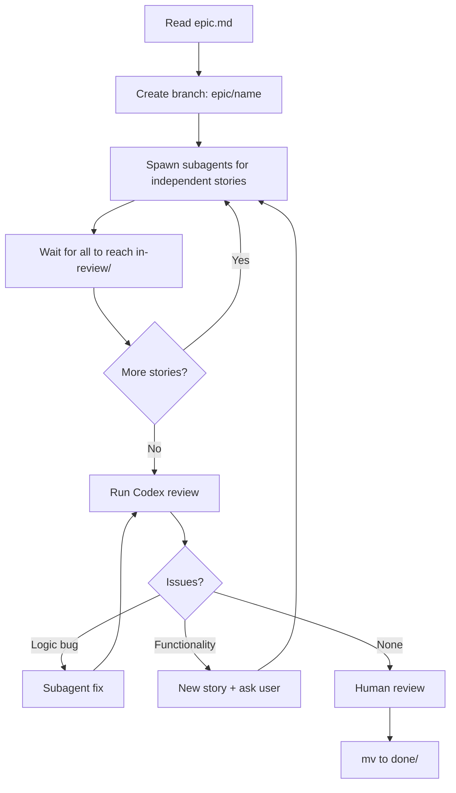

# Epic Workspace

Read `epic.md` first for vision, decisions, and dependency graph.

## Rules
- You are the **orchestrator**, not the implementer
- Spawn 3-4 subagents in parallel per wave
- Do NOT implement stories yourself (unless only one remains)
- Loop until Codex approves — no early exit
