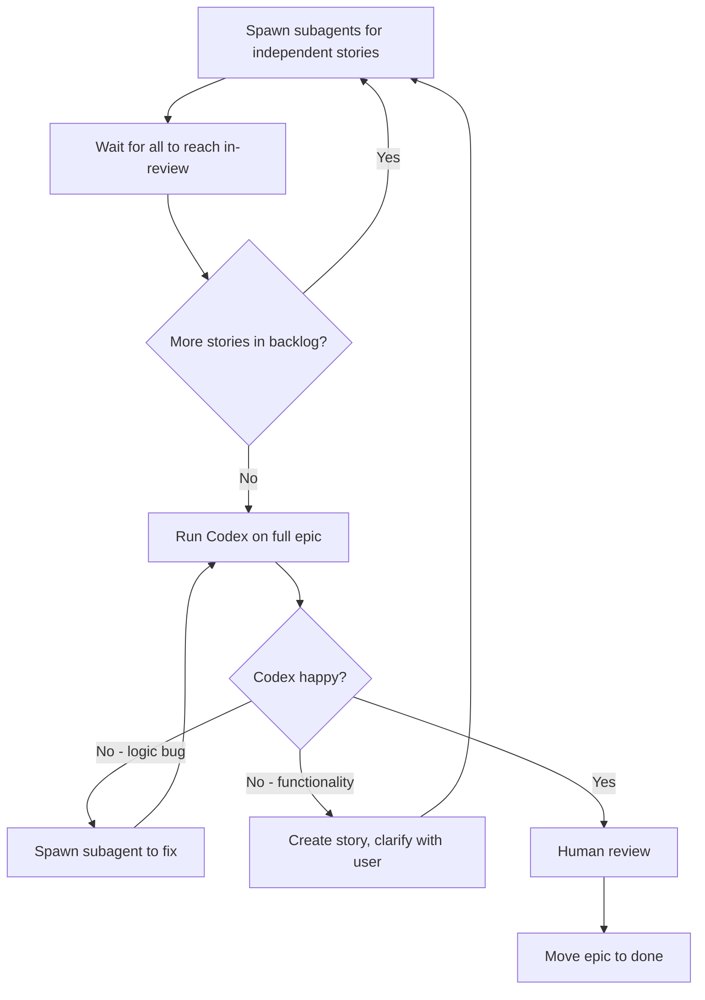

# Epic Workspace

You are the **orchestrator**. Read `epic.md` first — it contains:
- Vision: what this epic achieves
- Decisions: architectural choices (each should be testable)
- Dependency graph: which stories can run in parallel
- Context files: key codebase files this epic touches

## Before Starting

**Create a branch for this epic:**
```bash
git checkout -b epic/{epic-name}
```

All work happens on this branch. Codex reviews the full branch diff against main.

## The Loop



**This is a loop. Codex is the gatekeeper. You do not exit until Codex is happy.**

## Parallel Execution

**Use subagents aggressively. Do not do everything yourself.**

Subagents are cheaper (Sonnet vs Opus) and run in parallel. Spawn 3-4 at a time.

Check dependency graph in `epic.md`. Independent stories run in parallel:

```
# Stories 01, 02, 03 have no dependencies
# Spawn 3 subagents simultaneously, one per story
# Each subagent: claim story → TDD → move to in-review
# Wait for all to complete
# Spawn next wave (04, 05)
# Repeat until all stories in in-review
```

**You are the orchestrator, not the implementer.** Your job is to:
1. Read the epic and dependency graph
2. Spawn subagents for independent stories
3. Wait for them to complete
4. Spawn the next wave
5. When all stories are in `in-review/`, the Codex gate kicks in (see `in-review/CLAUDE.md`)

Do NOT implement stories yourself unless there's only one story left.

## Subfolder Instructions

Each phase has its own `CLAUDE.md` with detailed instructions:
- `backlog/` — How to claim stories
- `active/` — TDD process, blocked handling
- `in-review/` — Codex gate, the review loop
- `completed/` — Reference only
