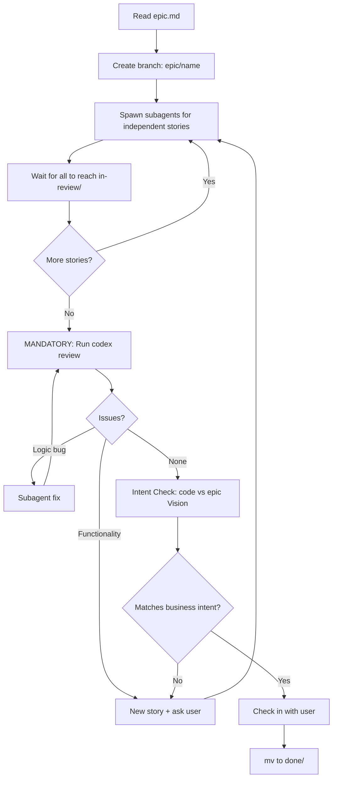

# Epic Workspace

Read `epic.md` first for vision, decisions, and dependency graph.

```mermaid
flowchart TD
    Start[Read epic.md] --> Branch[Create branch: epic/name]
    Branch --> Spawn[Spawn subagents for independent stories]
    Spawn --> Wait[Wait for all to reach in-review/]
    Wait --> More{More stories?}
    More -->|Yes| Spawn
    More -->|No| Codex[MANDATORY: Run codex review]
    Codex --> Issues{Issues?}
    Issues -->|Logic bug| Fix[Subagent fix] --> Codex
    Issues -->|Functionality| Story[New story + ask user] --> Spawn
    Issues -->|None| Intent[Intent Check: code vs epic Vision]
    Intent --> Drift{Matches business intent?}
    Drift -->|No| Story
    Drift -->|Yes| User[Check in with user]
    User --> Done[mv to done/]
```

## Rules
- You are the **orchestrator**, not the implementer
- Spawn 3-4 subagents in parallel per wave
- Do NOT implement stories yourself (unless only one remains)
- **MANDATORY: When all stories reach in-review, run exactly `codex review --uncommitted` — no extra flags, no `--model`, the global config handles it. This is the final gate. Do NOT skip it. Do NOT move to done without Codex approval.**
- Loop until Codex approves — no early exit
- **After Codex is clean: re-read `epic.md` Vision, verify the code fulfills the business intent, then check in with the user before moving to done. See `phases/in-review.md` for the full Intent Check process.**
