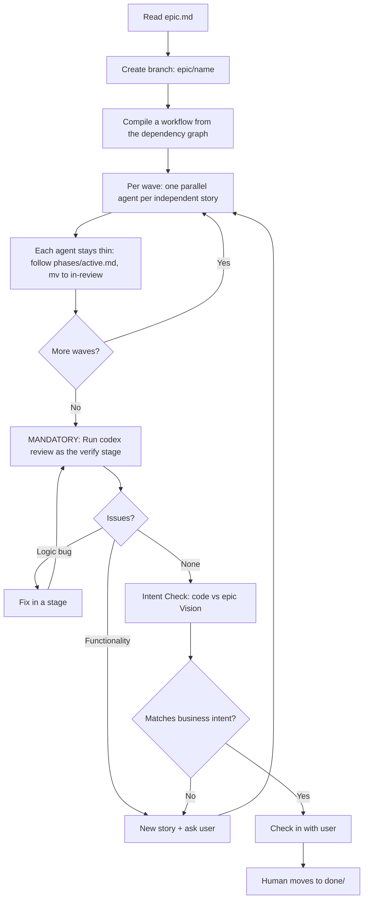

# Epic Workspace

Read `epic.md` first for vision, decisions, and dependency graph.

Once the epic is specced the graph is fixed, so execution is *compilable*: run
the epic as a **dynamic workflow** instead of spawning subagents by hand. The
script makes the gates un-skippable and keeps each story's output out of your
context. You are the **orchestrator**, not the implementer.

```mermaid
flowchart TD
    Start[Read epic.md] --> Branch[Create branch: epic/name]
    Branch --> Compile[Compile a workflow from the dependency graph]
    Compile --> Wave[Per wave: one parallel agent per independent story]
    Wave --> TDD[Each agent stays thin: follow phases/active.md, mv to in-review]
    TDD --> More{More waves?}
    More -->|Yes| Wave
    More -->|No| Codex[MANDATORY: Run codex review as the verify stage]
    Codex --> Issues{Issues?}
    Issues -->|Logic bug| Fix[Fix in a stage] --> Codex
    Issues -->|Functionality| Story[New story + ask user] --> Wave
    Issues -->|None| Intent[Intent Check: code vs epic Vision]
    Intent --> Drift{Matches business intent?}
    Drift -->|No| Story
    Drift -->|Yes| User[Check in with user]
    User --> Done[Human moves to done/]
```

## Compile the workflow this way
- **Waves come from the graph.** One `parallel()` wave per dependency layer,
  with a barrier between layers. Don't serialize independent stories; don't
  parallelize dependent ones.
- **Keep agents thin.** Each story agent's prompt points at `phases/active.md`
  and the story file — do NOT re-encode TDD in the script. The markdown is the
  source of truth; the script encodes only graph traversal + gates.
- **Lanes must not collide.** If parallel stories touch shared files, give each
  agent `isolation: 'worktree'`; otherwise keep them in disjoint files.
- **Pipeline where you can** — only barrier when a stage needs every prior
  result (the Codex gate does).

## Rules
- You are the **orchestrator**, not the implementer.
- **MANDATORY: When all stories reach in-review, run exactly `codex review --uncommitted` as the workflow's verify stage — no extra flags, no `--model`, the global config handles it. This is the final gate. Do NOT skip it. Loop until Codex approves — no early exit.**
- **After Codex is clean: re-read `epic.md` Vision, verify the code fulfills the business intent, then check in with the user. See `phases/in-review.md` for the full Intent Check.**
- The workflow STOPS at the intent check — the **human** moves the epic to `done/`.
- Trivial epic (1–2 stories, no deps)? Skip the workflow and just do it inline.
