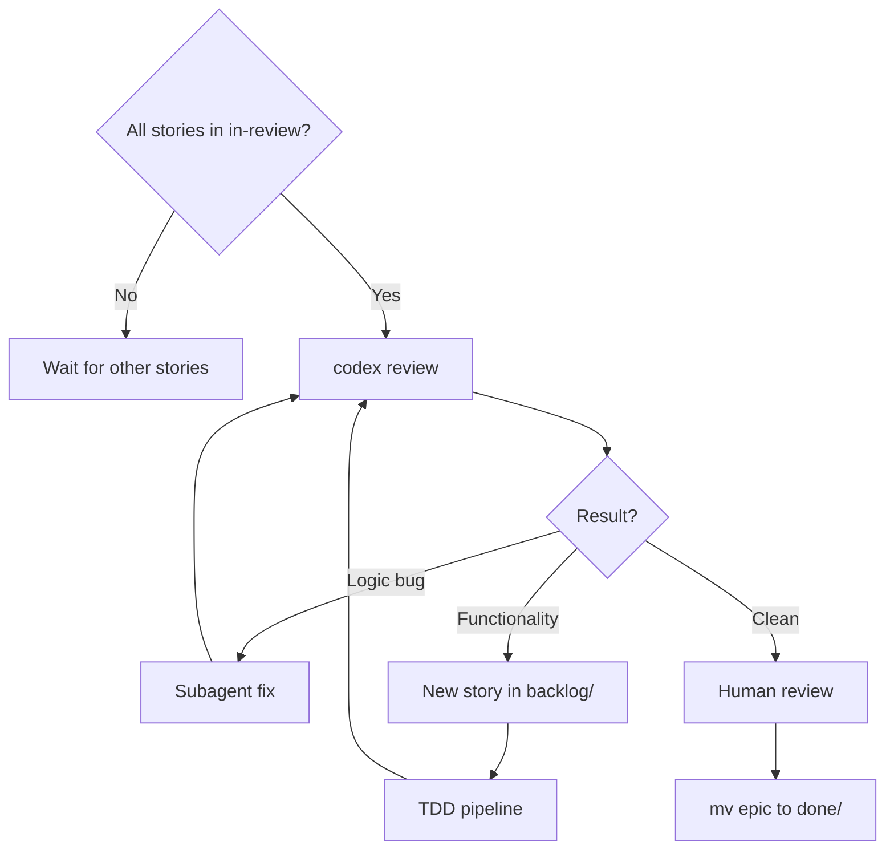

# In Review (Story)

Stories here have passing tests. Do not modify unless fixing Codex issues.

## Rules
- Codex is the gate — loop until it approves
- Logic bugs: fix immediately, re-run Codex
- Functionality issues: create story, ask user if ambiguous
