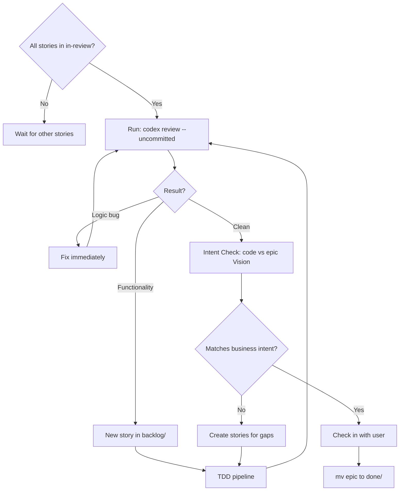

# In Review (Story)

Stories here have passing tests. Do not modify unless fixing Codex issues.


```mermaid
flowchart TD
    Check{All stories in in-review?}
    Check -->|No| Wait[Wait for other stories]
    Check -->|Yes| Codex[Run: codex review --uncommitted]
    Codex --> Result{Result?}
    Result -->|Logic bug| Fix[Fix immediately] --> Codex
    Result -->|Functionality| Story[New story in backlog/] --> TDD[TDD pipeline] --> Codex
    Result -->|Clean| Intent[Intent Check: code vs epic Vision]
    Intent --> Match{Matches business intent?}
    Match -->|No| Gap[Create stories for gaps] --> TDD
    Match -->|Yes| User[Check in with user]
    User --> Done[mv epic to done/]
```

## The Codex Gate

**MANDATORY. Do NOT skip this step. Do NOT move to done without running Codex.**

Run this command exactly. Do NOT modify it, do NOT add flags, do NOT try to figure out the CLI yourself.

```bash
codex review --uncommitted
```

The model is already configured in `~/.codex/config.toml`. Do NOT pass `-m`, `--model`, or `-c model=` flags — the global config handles it.

## Intent Check

**After Codex is clean, verify business intent before moving to done.**

1. Re-read the epic's `epic.md` — specifically the **Business Intent** section
2. Check each intent statement: is it true in the code that was built?
3. If there are gaps (features lost during Codex fix cycles, scope drift, missing intent):
   - Create new stories to close the gaps
   - Run them through TDD → Codex → repeat
4. When the code matches the intent, **check in with the user**:
   - Summarize what was built
   - Map it to the epic's Vision
   - Ask: "Does this match what you envisioned?"
5. User confirms → move to done

**Why:** Codex reviews code quality, not business intent. Fix cycles can silently drift from the original goal. This catch ensures what shipped is what was wanted.

## Rules
- **Do NOT move to done until Codex is clean**
- Logic bugs: fix immediately, re-run `codex review --uncommitted`
- Functionality issues: create story, ask user if ambiguous, TDD, re-run Codex
- Loop until Codex has no issues
- **After Codex is clean, run the Intent Check. Do NOT skip it.**
- **Do NOT move to done without user confirmation that intent was met.**
