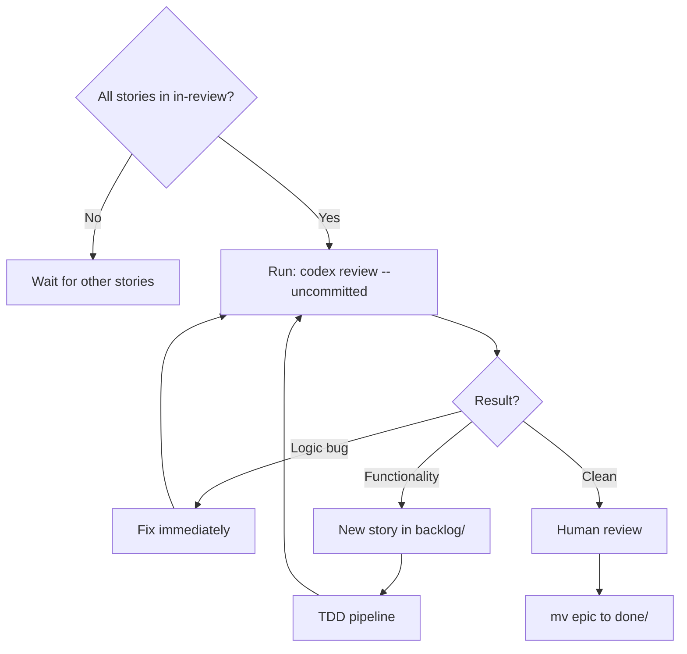

# In Review (Story)

Stories here have passing tests. Do not modify unless fixing Codex issues.



## The Codex Gate

**Run this exact command:**
```bash
codex review --uncommitted
```

This is the `codex` CLI tool, NOT a subagent. Wait for it to complete.

## Rules
- **Do NOT move to done until Codex is clean**
- Logic bugs: fix immediately, re-run `codex review --uncommitted`
- Functionality issues: create story, ask user if ambiguous, TDD, re-run Codex
- Loop until Codex has no issues
