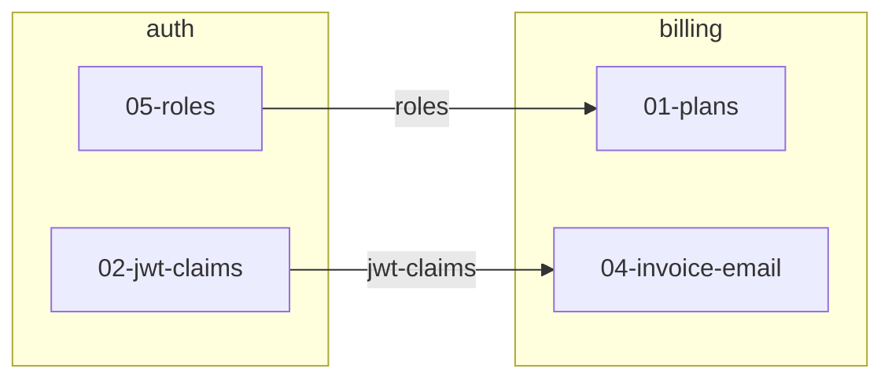

# Dash Name

## Vision
What is this dash about? Why do these epics ship together? One paragraph.

## Business Intent
<!-- What MUST be true when the whole dash ships? Checkable outcomes verified
     at the final Intent Check. Per-epic intent lives in each epic.md — this
     section is for outcomes that only exist when the epics land TOGETHER. -->
<!-- Example:
- A user can sign up, pick a plan, and get billed — end to end
- Roles from the auth epic gate every billing admin action
-->

## Epics
<!-- One line each: name — what it delivers. -->

## Cross-Epic Edges
<!-- Every edge must cite a contract and grep evidence. No contract, no edge.
     An edge means: the blocked story may not start until the blocking story
     is in completed/ (merged = reviewed). Reference stories as epic/NN-name,
     no lifecycle folders. -->
<!-- Example:
| Blocking story | Blocked story | Contract | Evidence |
|---|---|---|---|
| auth/02-jwt-claims | billing/04-invoice-email | jwt-claims | both stories: systems: [auth] + touch middleware/claims.go |
-->
| Blocking story | Blocked story | Contract | Evidence |
|---|---|---|---|

## Graph
<!-- One story-level DAG spanning all epics. In-epic edges live in each
     epic.md — only draw cross-epic edges here. -->
<!-- Example:

-->

## Decisions
<!-- Cross-epic decisions made during the weave. Per-epic decisions go in epic.md. -->

## Notes
<!-- Anything else the orchestrator should know -->
