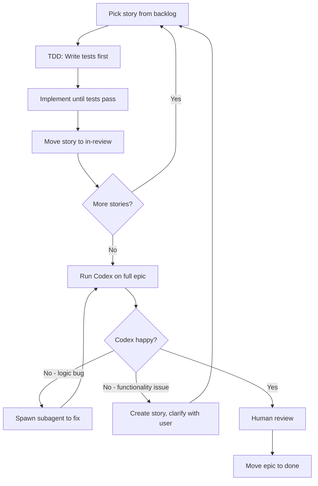

# Epic Workspace

You are inside an epic. Read `epic.md` first — it contains:
- Vision: what this epic achieves
- Decisions: architectural choices (each should be testable)
- Dependency graph: which stories can run in parallel
- Context files: key codebase files this epic touches

## Before Starting

**Create a branch for this epic:**
```bash
git checkout -b epic/{epic-name}
```

All work happens on this branch. Codex reviews the full branch diff against main.

## The Loop

**This is a loop. Codex is the gatekeeper. You do not exit until Codex is happy.**



Codex reviews the **full epic at once** (not per-story). This is intentional — Codex takes time, so batch the review. While Codex runs, you wait. This is the holding pattern.

## TDD is Non-Negotiable

Every story follows TDD:
1. **Red** — Write tests that encode acceptance criteria. Run them. They fail.
2. **Green** — Write code until tests pass. Nothing more.
3. **Refactor** — Clean up while tests stay green.

No implementation without failing tests first. Tests ARE the spec.

## Story Flow

### 1. Claim a Story
```bash
mv backlog/01-story.md active/
```
Update frontmatter: `agent: your-id`, `agent_status: implementing`

### 2. TDD
- Write tests for acceptance criteria
- Implement until green
- Run linter, fix issues

### 3. Story Done
When tests pass and lint is clean:
```bash
mv active/01-story.md in-review/
```

### 4. Next Story
Go back to step 1. Pick next story from backlog.

## Parallel Execution

Check dependency graph in `epic.md`. Independent stories can run in parallel:

```
# Stories 01, 02, 03 have no dependencies
# Spawn 3 subagents, one per story
# Each subagent runs TDD, moves to in-review
# Wait for all to complete
# Then spawn next wave
```

## Epic Review (Codex)

When all stories are in `in-review/`:

1. **Run Codex on full epic** (`codex review` against main branch)
2. **Wait** — Codex takes time. This is the holding pattern. Don't burn tokens.
3. **Handle Codex feedback:**

### Logic Bug (quick fix)
Typo, null check, off-by-one, lint issue, simple oversight.
→ Spawn a subagent to fix immediately
→ Run Codex again

### Functionality Issue (needs clarification)
Missing feature, wrong behavior, misaligned with requirements, architectural concern.
→ Create a new story in `backlog/`
→ Clarify with user if ambiguous
→ Run story through the loop
→ Run Codex again

4. **Loop until Codex is happy**
5. **Human reviews** all stories in `in-review/`
6. **Human moves epic to `done/`**

**Do not skip Codex. Do not exit early. The loop continues until Codex approves.**

## Escalation

If a story doesn't answer something you need: **STOP.**

1. Write question under `## Blocked`
2. Update `agent_status: blocked`
3. Report to user
4. Do NOT assume. Do NOT proceed.

Assuming is how agents drift.
