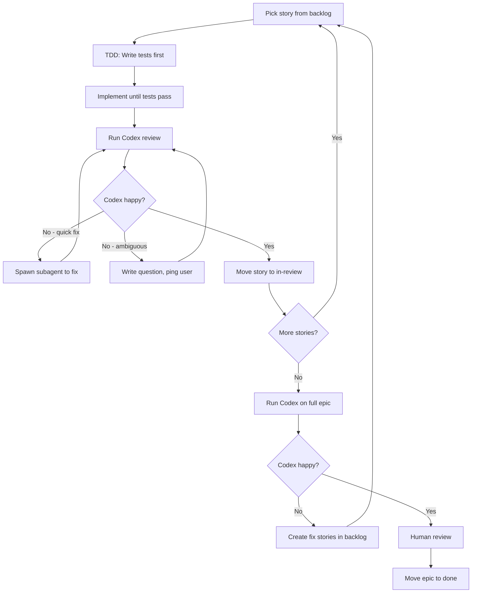

# Epic Workspace

You are inside an epic. Read `epic.md` first — it contains:
- Vision: what this epic achieves
- Decisions: architectural choices (each should be testable)
- Dependency graph: which stories can run in parallel
- Context files: key codebase files this epic touches

## The Loop

**This is a loop. Codex is the gatekeeper. You do not exit until Codex is happy.**



## TDD is Non-Negotiable

Every story follows TDD:
1. **Red** — Write tests that encode acceptance criteria. Run them. They fail.
2. **Green** — Write code until tests pass. Nothing more.
3. **Refactor** — Clean up while tests stay green.

No implementation without failing tests first. Tests ARE the spec.

## Story Flow

### 1. Claim a Story
```bash
mv backlog/01-story.md active/
```
Update frontmatter: `agent: your-id`, `agent_status: implementing`

### 2. TDD Loop
- Write tests for acceptance criteria
- Implement until green
- Run Codex review

### 3. Handle Codex Feedback

**Quick fix** (typo, missing null check, style issue):
→ Spawn a subagent to fix immediately
→ Run Codex again

**Ambiguous issue** (unclear requirement, architectural question):
→ Write question under `## Blocked` in story
→ Ping the user
→ Wait for clarification
→ Then continue

### 4. Story Done
When Codex is happy with the story:
```bash
mv active/01-story.md in-review/
```

### 5. Next Story
Go back to step 1. Pick next story from backlog.

## Parallel Execution

Check dependency graph in `epic.md`. Independent stories can run in parallel:

```
# Stories 01, 02, 03 have no dependencies
# Spawn 3 subagents, one per story
# Each subagent runs the full TDD + Codex loop
# Wait for all to reach in-review
# Then spawn next wave
```

## Epic Completion

When all stories are in `in-review/`:

1. **Run Codex on full epic** (diff against main)
2. **If Codex finds issues:**
   - Create fix stories in `backlog/`
   - Run them through the loop
   - Back to step 1
3. **If Codex is happy:**
   - Human reviews all stories
   - Human moves epic to `done/`

**Do not skip Codex. Do not exit early. The loop continues until Codex approves.**

## Escalation

If a story doesn't answer something you need: **STOP.**

1. Write question under `## Blocked`
2. Update `agent_status: blocked`
3. Report to user
4. Do NOT assume. Do NOT proceed.

Assuming is how agents drift.
